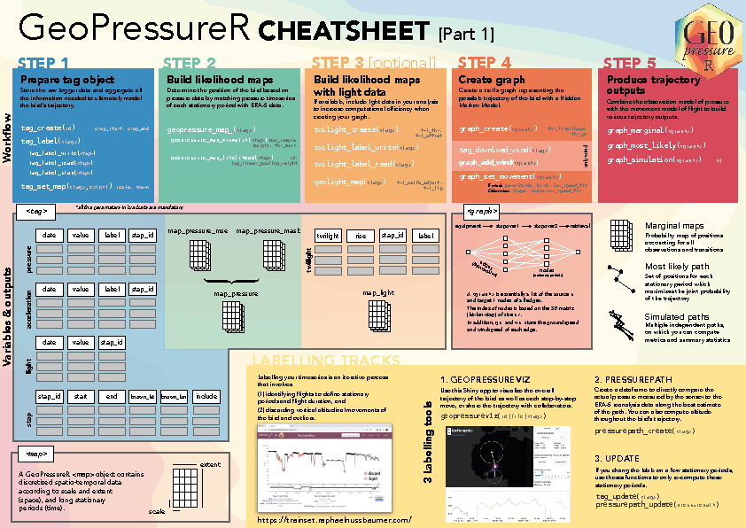
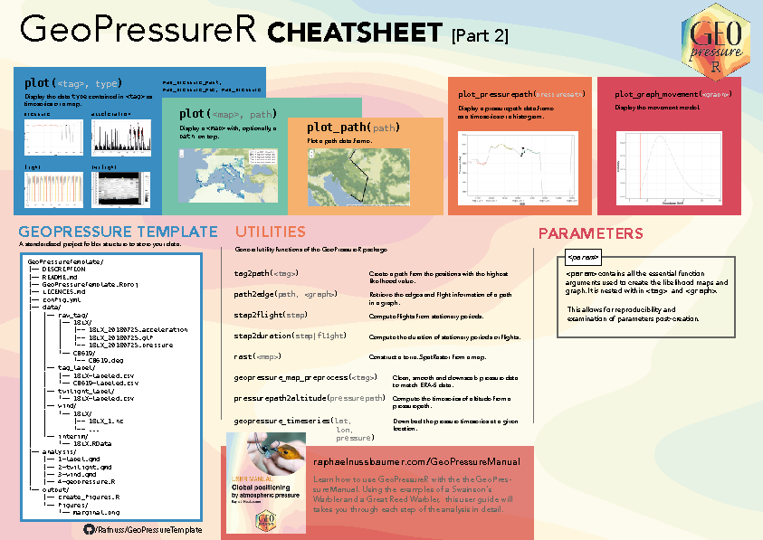

<!-- README.md is generated from README.Rmd. Please edit that file and use devtools::build_readme() -->

# GeoPressureR 

<!-- badges: start -->

[](https://doi.org/10.5281/zenodo.7754457)
[](https://github.com/Rafnuss/GeoPressureR/actions/workflows/R-CMD-check.yaml)
[](https://github.com/Rafnuss/GeoPressureR/actions/workflows/pkgdown.yaml)
[](https://app.codecov.io/gh/Rafnuss/GeoPressureR?branch=master)
[](https://github.com/Rafnuss/GeoPressureR/actions/workflows/jarl-check.yaml)
[](https://github.com/Rafnuss/GeoPressureR/actions/workflows/format-check.yaml)
[](https://lifecycle.r-lib.org/articles/stages.html#stable)
<!-- badges: end -->

**GeoPressureR** is a R package which help researchers construct the
trajectory of a bird equipped with an atmospheric pressure sensor. The
package is a direct implementation of methods presented in Nussbaumer et
al. ([2023a](https://doi.org/10.1111/2041-210X.14043)) and Nussbaumer et
al. ([2023b](https://doi.org/10.1111/2041-210X.14082)).

## Installation

The best way to install the GeoPressureR package is through Github

``` r
# install.packages("pak")
pak::pkg_install("Rafnuss/GeoPressureR")
```

## Learn how to use GeoPressureR

The
[GeoPressureManual](https://raphaelnussbaumer.com/GeoPressureManual/) is
a great place to start learning about how to use GeoPressureR.

Using the examples, this user guide takes you through each step of the
analysis in detail.

<p align="center">

<a href="https://raphaelnussbaumer.com/GeoPressureManual/"></a>
</p>

## Start your own analysis

Once you are familiar with the workflow of the method and want to start
your own study, we suggest you use
[GeoPressureTemplate](https://github.com/Rafnuss/GeoPressureTemplate), a
[github template
repository](https://docs.github.com/en/repositories/creating-and-managing-repositories/creating-a-template-repository)
which provides a standard code structure for your analysis.

Using this standardized code structure you will help you on many aspect:
code sharing and troubleshooting, data archiving, work reproducibility.

## Cheatsheet

<a href="https://github.com/Rafnuss/GeoPressureR/raw/master/man/figures/cheatsheet.pdf" target="_blank">

 </a>

## How to cite?

Make sure to cite the correct reference (R package, papers of the
underlying methods and/or user manual) according to your use:

> Nussbaumer, R., & Gravey, M. (2022). *GeoPressureR: Global positioning
> by atmospheric pressure.* Zenodo.
> <https://doi.org/10.5281/zenodo.7754457>. Available at:
> <https://github.com/Rafnuss/GeoPressureR>

> Nussbaumer, R., Gravey, M., Briedis, M., & Liechti, F. (2023). Global
> positioning with animal-borne pressure sensors. *Methods in Ecology
> and Evolution, 14*(4), 1104–1117.
> <https://doi.org/10.1111/2041-210X.14043>

> Nussbaumer, R., Gravey, M., Briedis, M., Liechti, F., & Sheldon, D.
> (2023). Reconstructing bird trajectories from pressure and wind data
> using a highly optimised hidden Markov model. *Methods in Ecology and
> Evolution, 14*(4), 1–32. <https://doi.org/10.1111/2041-210X.14082>

> Nussbaumer, R., & Nussbaumer, A. (2024). *GeoPressureManual: Learn how
> to use GeoPressureR with examples.* Zenodo.
> <https://doi.org/10.5281/zenodo.10799355>. Available at:
> <https://github.com/Rafnuss/GeoPressureManual>

Get citation information in R with `citation("GeoPressureR")`.
