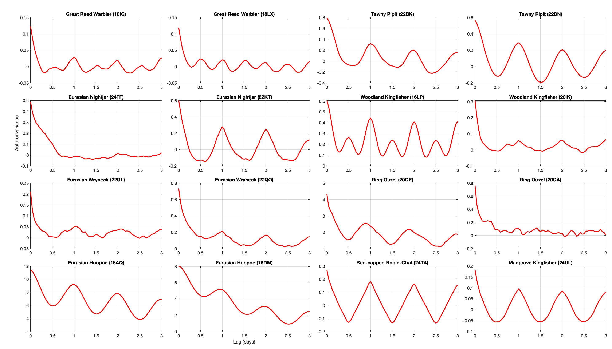

```{r, include = FALSE}
knitr::opts_chunk$set(
  collapse = TRUE,
  comment = "#>"
)
```


At the core of GeoPressure, we try to estimate the position of the bird $\textbf{x}$ based on a pressure mismatch of the geolocator and the ERA5. A major challenge in this process is the transformation of map of errors (mismatch) into a probability.

In this vignette will explore some theoritical background and the solution proposed here. 

## Problem presentation

For each stationary period, we estimate probability of the  position of the bird $\textbf{x}$ based on a pressure timeseries measured by the geolocator $p_{gl}[t] \quad \forall t \in [1,\ldots,n]$, which in a Bayesian framework can be written as, 
$$p(\textbf{x}\mid P_{gl}[1],\ldots,P_{gl}[n]) \propto p(P_{gl}[1],\ldots,P_{gl}[n] \mid \textbf{x}) p(\textbf{x}).$$

We are interested here in determining the likelihood term $P(P_{gl} \mid \textbf{x})$ using quantifiy the probability of observing the timeserie $P_{gl}$ knowing that the bird is at location $\textbf{x}$. To quantify this probability, we look at the mismatch between $P_{gl}$ and the pressure timesrie of the ERA5 database $P_{ERA5}(\textbf{x})$ extracted at location $\textbf{x}$. We can reformulate the likelihood as as a probability function $f$ of an error term $\varepsilon(\textbf{x})$ which dependent in some way of $P_{gl}$ and $P_{ERA5}(\textbf{x})$
$$p(P_{gl} \mid \textbf{x}) = f(\varepsilon[1],\ldots,\varepsilon[n])$$

We have splitted our problem in two: first defining an error term $\varepsilon[t]$ and secondly defining the likelihood function $f$.

## Error term
One would expect to simply use the difference
$$\varepsilon[t] =  P_{ERA5}(\textbf{x})[t]-P_{gl}[t].$$
However, because $P_{ERA5}$ is given at the mean ground level of a grid cell of 9-30km, we can only expect the bird can be on a wide range of altitude within that grid. As such there is likely to be an offset between the two timeserie explained by the change of altitude.
To solve this issue, we remove the mean pressure difference, essentially ignoring the absolute value of pressure (altitude) and only look at the temporal variation, 
$$\varepsilon[t] =  P_{ERA5}(\textbf{x})[t]-P_{gl}[t] - \left( \frac{1}{n}\sum_{i=1}^{n} P_{ERA5}(\textbf{x})[i]-P_{gl}[i] \right).$$

This way of building our error term has some important consequences. If you think of a timeseries of only one datapoint, the error term will be zero at all locations, resulting in an equally probable map. As the number of datapoint increase, the errors term will be more and more able to distinguish between "good" and "bad" location.

## Eror in the Great Reed Warbler
To illustrate this vignet, we'll be using the same Great Reed Warbler (18LX) than the other vignettes.

```{r setup}
library(raster)
library(GeoPressureR)
pam_data = pam_read(system.file("extdata", package = "GeoPressureR"),
                    crop_start = "2017-06-20", crop_end = "2018-05-02")
pam_data = trainset_read(pam_data, system.file("extdata", package = "GeoPressureR"))
pam_data = pam_sta(pam_data)

sta_id_keep = pam_data$sta$sta_id[difftime(pam_data$sta$end,pam_data$sta$start, units = "hours")>12]
pam_data$pressure$sta_id[!(pam_data$pressure$sta_id %in% sta_id_keep)] = NA
```

We are using [the GeoPressure API](https://raphaelnussbaumer.com/GeoPressureServer/#description) with the `geopressure_map()` function tomeasure the mismatch of the pressure series. However, because the API can realistically return only a single map per stationary period, it already aggregate the error into a single term, which is the Mean Square Error (MSE) of the errors, 
$$\mathit{MSE} = \frac{1}{n}\sum_{t=1}^{n} \varepsilon[t]^2$$
```{r, include=F}
data("raster_list", package = "GeoPressureR")
```
```{r, eval = F}
raster_list = geopressure_map(pam_data$pressure, extent=c(-16,20,0,50), scale=10, max_sample=100)
```

We can access the number of datapoint of each stationay period

```{r}
sta <- data.frame()
raster_mse_list <- c()
for (i_s in 1:length(raster_list)) {
  # get MSE layer
  raster_mse_list[[i_s]] <- raster_list[[i_s]][[1]]
  # change 0 (water) in NA
  raster_mse_list[[i_s]][raster_mse_list[[i_s]] == 0] <- NA
  
  # Acess geotiff metadata
  mt <- raster::metadata(raster_list[[i_s]])
  
  mt$start=mt$extend_sample[1]
  mt$end=mt$extend_sample[2]
  tmp = as.data.frame(raster_mse_list[[i_s]][[1]],xy=T)
  mt$lon = tmp$x[which.min(tmp[,3])]
  mt$lat = tmp$y[which.min(tmp[,3])]
  
  sta = rbind(sta,as.data.frame(mt[-4]))
}
```

## Gaussian likelihood function

In order to find an appropritate likehood function, we need to assume a certain distribution of our error. The sources of the errors are (1) the sensor measurement error, (2) the ERA5 reanalysis error and (3) the attitudinal movement of the bird during this time. Because we ar removing the mean error, we can ignore any long-term errors (e.g., constant temporal error in ERA5 or baise in the geolocator sensor). 

We can actually look at the error distribution at the known location of the bird to get an idea of the distribution. In the case of the Great Reed warbker, sigma is around 0.5

{width=100%}

It seems relatively ok to assume a Gaussian distribution.

In the general case, the [gaussian likelkhood](https://en.wikipedia.org/wiki/Maximum_likelihood_estimation#Non-independent_variables) is the multivariate normal distribution, 
$$ f(\boldsymbol{\varepsilon})={\frac {1}{(2\pi)^{n/2} \sqrt{\det(\boldsymbol{\Sigma})}}}\exp \left(-\frac{1}{2} \boldsymbol{\varepsilon} \boldsymbol{\Sigma}^{-1} \boldsymbol{\varepsilon} \right).$$
with the vector notation $\boldsymbol{\varepsilon }=[\varepsilon[1],\ldots,\varepsilon[n]]$ and the covariance matrix $\boldsymbol{\Sigma}$ measure the variance of two datapoint $\boldsymbol{\Sigma}_{t_1,t_2} = \operatorname {E}[ \varepsilon[t_1] \varepsilon[t_2] ]$.

This covariance is quite difficult to quantifies explicitily, so we will explore option to make it more simple. 

## Independance of errors

If we make the assumption that the error are independent, $\varepsilon_t \overset{i.i.d.}{\sim} \mathcal{N}(0,\sigma)$, the [gaussian likelkhood](https://en.wikipedia.org/wiki/Maximum_likelihood_estimation#Continuous_distribution,_continuous_parameter_space) is then simply the product of the normal probability density function of each error $\varepsilon[t]$, 
$$ f_{ind}(\boldsymbol{\varepsilon})=\prod _{t=1}^{n}f(\varepsilon[t] \mid 0,\sigma)=\left({\frac {1}{2\pi \sigma ^{2}}}\right)^{n/2}\exp \left(-{\frac {\sum _{t=1}^{n}\varepsilon[t]^2}{2\sigma ^2}}\right).$$
This equation is equivalent to set the covariance matrix as a diagonal matrix with the standard deviation $\sigma$ on all its diagonal element. 

We can re-write this equation as a function of the MSE
$$ f_{ind}(\boldsymbol{\varepsilon})=\left({\frac {1}{2\pi \sigma ^{2}}}\right)^{n/2}\exp \left(-{\frac {n\mathit{MSE}}{2\sigma ^2}}\right).$$

We can compute the probability for each stationary periods of our bird

```{r}
s=0.5

f_prob = function(n,s,x){
  (1/(2*pi*s^2))^(n/2)*exp(-n*x/2/s^2)
}

fun_plot_prob <- function(f_prob,sta,raster_list){
  raster_prob_list <- c()
for (i_s in 1:length(raster_list)) {
  n = sta$nb_sample[i_s]
  raster_prob_list[[i_s]] <- f_prob(n,s,raster_mse_list[[i_s]])
}
iis = c(1, 2, 5, 17, 24, 26)
sta[iis,]
dl=5
par(mfcol=c(2, length(iis)), mar=c(0,0,7,0), mai=c(0, 0, .1, 0))
for (i_s in iis){
  plot(raster_mse_list[[i_s]], 
       main=paste0("MSE|i_s=",i_s,"|n=",sta$nb_sample[i_s]), 
       horizontal = TRUE, 
       axes = FALSE, 
       legend.shrink=.8,
       xlim=c(sta$lon[i_s]-dl,sta$lon[i_s]+dl), ylim=c(sta$lat[i_s]-dl,sta$lat[i_s]+dl)
       )
  points(sta$lon[i_s],sta$lat[i_s] )
}
for (i_s in iis){
  plot(raster_prob_list[[i_s]], main="Prob", 
       horizontal = TRUE, axes = FALSE, legend.shrink=.8,
       xlim=c(sta$lon[i_s]-dl,sta$lon[i_s]+dl), ylim=c(sta$lat[i_s]-dl,sta$lat[i_s]+dl)
       )
  points(sta$lon[i_s],sta$lat[i_s] )
}
}

fun_plot_prob(f_prob,sta,raster_list)

```

As you can see from theses 6 examples that the probability transform the MSE into very narrow  uncertainties range. So narrow that for very long stationay period (i_s=1 and 17), the map becomes 0 everywhere.

This comes from the multiplication of probability assumed in the independence case (see equation above). The underlying assuming is the [conjunction of probabilities](https://en.wikipedia.org/wiki/Logical_conjunction), the aggregation is done by by the AND operator: $P(A~\text{and}~B) = P(A)\times P(B)$.

## Dependance of errors

Ploting the auto-covariance at the calibration site for all the species allows to see some strong temporal pattern. In most bird, you can see a clear daily fluctutation which is certainly due to the bird daily movement for comute between feeding and roosting site. The auto-covariance is approaching 0 for all birds, which is expected as we removed the mean value. Hoever, the [sill](https://en.wikipedia.org/wiki/Variogram) is reached between  6hours  to 12 hours for most birds. Hoopoe doesn't reach it after 3 days.

{width=100%}

## Log-linear pooling, general terminology

In the field of [proability aggreation](https://link.springer.com/article/10.1007/s11004-012-9396-3), the probbleome of combining sources of informations with overlaping content is frame as finding a pooling operator $F$ such that,
$$p(\textbf{x}\mid \varepsilon[1],\ldots,\varepsilon[n]) \approx F(p(\textbf{x} \mid \varepsilon[1]) ,\ldots,p(\textbf{x} \mid \varepsilon[n])).$$

Assuming a gaussian likelihood for each error seperatly, $p(\textbf{x} \mid \varepsilon[t]) = f(\varepsilon[t])$, we can rewrite the objectif of finding a function combining the error likelihood
$$F(\boldsymbol{\varepsilon}) = F(f(\varepsilon[1]),\ldots,f(\varepsilon[n]))$$
The log-linear pooling is a common operator used in this context,

$$F(\boldsymbol{\varepsilon}) \propto \prod_{t=1}^n f(\varepsilon[t])^{w_t}.$$


It's quite easy to see that if $w_t=1$, the log linear pooling become identical to the case of independent $F = f_{ind}(\boldsymbol{\varepsilon})$. Case that we have alread explored earlier.

Using the gaussian probability density function formula, we can write

$$f(\varepsilon[t])^{w_t} = \left({\frac {1}{2\pi \sigma ^{2}}}\right)^{w_t/2}\exp \left(-w_t{\frac {\varepsilon[t]^2}{2\sigma ^2}}\right).$$

As such, if we assume $w_t=w$ to be constant, we can rewritte the pooling aggregator as
$$F(\boldsymbol{\varepsilon}) \propto \left({\frac {1}{2\pi \sigma ^{2}}}\right)^{\frac{wn}{2}} \exp \left(-{\frac {w}{2\sigma ^2}}\sum _{t=1}^{n}\varepsilon[t]^2\right).$$

written with the MSE
$$F(\boldsymbol{\varepsilon}) \propto \left({\frac {1}{2\pi \sigma ^{2}}}\right)^{\frac{wn}{2}} \exp \left(-{\frac {wn}{2\sigma ^2}}\textit{MSE}\right).$$

## Log-linear pooling, $w=1/n$

An intresting case of is if $w_t=1/n$, in which case $\sum_t w_t=1$ 

$$ F(\boldsymbol{\varepsilon})={\frac {1}{\sigma\sqrt{2\pi} }}\exp \left(-{\frac {1}{2\sigma ^2}\mathit{MSE}}\right).$$
This equation is actually the normal prob dist of the MSE.

You can see from that expression that $n$ disappeared. In such case, the probability is only dependent from the means square of the error.

-> external Bayesianity is preseverve. 

Let see the influence on the probability map.

```{r}
f_prob = function(n,s,x){
  w = 1/n
  (1/(2*pi*s^2))^(n*w/2)*exp(-w*n/2/(s^2)*x)
}
fun_plot_prob(f_prob,sta,raster_list)
```

As expected from the disappearance of n, the uncertainty is now completely independent from the duration of the stationary period.

This is obviously not what we want, but shows the other extreme.

## Log-linear pooling, $w = \log(n)/n$

In the paper we chosed to use $w=\frac{\log(n)}{n}$, 

$$F(\boldsymbol{\varepsilon}) \propto \left({\frac {1}{2\pi \sigma ^{2}}}\right)^{\frac{w\log(n)}{2}} \exp \left(-{\frac {\log(n)}{2\sigma ^2}}\textit{MSE}\right).$$

This scheme offers a sch

```{r}
f_prob = function(n,s,x){
  w = log(n)/n
  (1/(2*pi*s^2))^(n*w/2)*exp(-w*n/2/(s^2)*x)
}
fun_plot_prob(f_prob,sta,raster_list)
```
