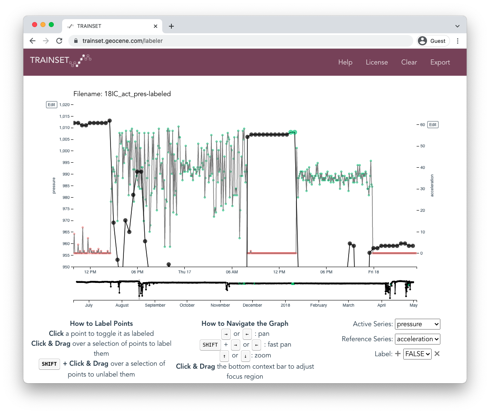

```{r, include = FALSE}
knitr::opts_chunk$set(
  warning = FALSE, 
  message = FALSE,
  collapse = TRUE,
  comment = "#>"
)
```

```{r setup}
library(GeoPressureR)
library(raster)
library(plotly)
library(RColorBrewer)
```

In this vignette, we'll explore how to label your track files (activity and pressure), and I'll try to provide some useful tips to make that smoother, faster and more sucessful

## Why a manual labeling?

You might wonder, with machine learning, surely, there is no need to do anything manually anymore. Why the heck should I bother with a manual editing?

1. Put simply, it will be faster. Trying to find an algorithm that work for all species, individuals, type of migration is probably not possible. Trying to get any algorithm tuned to the specific track will take more time than going through each track. You can expect to spend between 30sec to 10min per tracks. 

More than saving time, it will give you a sense of what your bird is doing. You'll get to know how it's moving (e.g., long continuous high altitude flight, short ones over multiple days, alternation between short migration-stopover etc...). It will also give you an idea of the uncertainty of your classification. Is the bird really moving or is it just a changing altitude? All of that will be very useful to analyse the track later. 

But the more important reason for doing that is that the pressure mapping required very highly accurately labelled acitivity and pressure data. Firstly activity labeling defined stationary period and flight duration. Short stationary period can be particularly hard to defined, so that expert knowledge might be very useful. Flight duration has an important impact on the movement model so that for short successive stationary period (when pressure mapping is not precise), you really want to be accurate with the flight duration to have good esitmation of bird's position. Secondly, the pressure timeserie matching algorithm is very sensitive to erroneously labeled pressure, such that even a single mislabeled datapoint can through off the estimation map. 

That being said, it is worth starting the manual editing with the automatically labeled timeserie. Check out possible classification method on the [PALMr manual](https://kiranlda.github.io/PAMLrManual/index.html).

## Overview of the process

1. run an automatic classification (e.g., `classify_flap()`)
2. create the label csv file (`trainset.write()`, `18IC_act_pres.csv`)
3. open the file on [www.trainset.geocene.com](https://trainset.geocene.com/)
4. label activity and pressure
5. export the labeled csv file (`18IC_act_pres-labeled.csv`)
6. read the file in R (`trainset.read()`)

See an example of this process in the section ["Editing of Pressure and Activity on Trainset" of basic example](basic_example.html#editing-of-pressure-and-activity-on-trainset)

The truth about the process is that you'll repeat step 2-6 mulitiple time after looking a the pressue timeserie match. 

## Quick tour of trainset

) is "*a lightweight web application for brushing labels onto time series data; useful for building training sets.*"](labeling_tracks_1.png){width=100%}

You can read more about trainset on [www.trainset.geocene.com](https://trainset.geocene.com/) and https://github.com/Geocene/trainset. 

All should be quite intuitive: upload the csv file (e.g., `18IC_act_pres.csv`).

{width=100%}

Here are a few things not to miss: 
- **Keyboard shortcut** are super useful for navigation (zoom in/out, move left/right) and labeling (add/remove a label).
- Because of the number of datapoint (depending on the resolution of the track), you might one to keep the a narrow temporal window to avoid your browser to get slow or irresponsive.
- You can change the **"Reference Series"** to pressure to see both timeseries at the same time which is very useful to see what the bird is doing.
- You will also have to play with the y-axis range to see properly the small pressure variation. This is important, because you might miss an outiliar which doesn't stands out with the full range (e.g., 500-1500 hPa) but  
- Trainest is offers more flexibility with the label than required: you can add and remove label value (bottom-right of the page. In order for `trainset.read()` to work, don't change/edit/add any label, simply use the one offered : "FALSE" and "TRUE".

{width=100%}

## Best practices

Your task is relatively simple: label migratory activity as "TRUE" in *accelaration* and remove pressure outliar with "TRUE" in the *pressure* timeserie. However, there are a lot of small loophole which can make this task actually very difficult. Let see some of them through exemples.

{width=100%}

{width=100%}

{width=100%}

There will be situation were certain classification of activity is not possible. It is worth reminding that the labelisation of activity is two-fold: 
- Define flight duration, which will be used in the movement model and ultimately have the strongest impact on (1) the estimation of the position of short stopver between long flight (i.e, how ) and (2) estimation of fight speed when the position of the bird is well constrain. Ultimately a few datapoint more or less won't have strong impact on long flight. But estimation of short movement can be relatively tricky. To partially accommodate for this, we compute an `effort_duration` for each flight, which normalize the duration of migratory flight by the intensity of the activity over the entire journey of the bird. 
- Define stationary period, which will be used to in the pressure timeserie matching. 

At this stage, it is very useful to add pressure timeserie to understand the implication of defining stationary period on pressure timeseries

{width=100%}

I think it's best to think of stationary period, as period were the pressure timeserie is continuous enough to be able to match on the map.

A balence need to the found between creating enough stationary period to account for all position of the bird able to be estimated and creating too many stationary period, where you loose the duration of the timeserie able to match. This is important, because we are looking in creating long timeserie of pressure containing sufficient temporal varation, but not variation which are due to local/short movement (often because of latitude varition.

So, one option we have is to label activity to create new stationary period. The other option to avoid having to create too many stationary period is to label pressure time serie as outliar. These datapoint won't be used in the match of the timeserie.

![Here is a possible way to handle the Red-capped Robin-chat example. Tightening the pressure y axis while increase the time x axis allows to better see the generally smooth natural temporal varation of pressure that we want to capture. The fine-scale temporal variation of pressure can then be attributated to bird local movement (e.g. foraging in area with topographical varation). My propostion here is to create a new stationay period of a couple of hours and then mark pressure variation up to the 13th as outliar due to too much variation as well as the varation around 9am.](labeling_tracks_9.png){width=100%}
## Sample code

This small script was written to help you get started with checking your labelization

You can see [the basic example vignette](basic_example) to get more background on the processing before the labelization.
```{r}
pam_data = read_pam(pathname = system.file("extdata", "/", package = "GeoPressureR") )
pam_data = crop_pam(pam_data, as.POSIXct("2017-06-20","%Y-%m-%d", tz="UTC"), as.POSIXct("2018-05-02","%Y-%m-%d", tz="UTC"))
```

**Test 1**: Duration of stationary period and flight

A first easy test to check your labelization is computing the duration of the flight and stationary period.

For this exemple, I'm using the first version exported from trainset

```{r}
pam_data = trainset_read(pam_data, system.file("extdata", "/", package = "GeoPressureR"), filename = "18LX_act_pres-labeled-v1.csv")
pam_data = sta_pam(pam_data)
knitr::kable(pam_data$sta[difftime(pam_data$sta$end,pam_data$sta$start, units = "mins")<60 | pam_data$sta$next_flight_duration<30,])
```
You probably don't want stationary period and flight duration shorter than a couple of hours. You can go back to trainset using the exact time from the table above to adapt the labelization as you see fit and export a new version of the `csv` file. 
Note that the last row has a `nextFlightDuration` of zero because it's the last stationary period. 


**Test 2**: Pressure timeserie

The second check to do before computing the map is to visualize the timeserie of pressure and their grouping into stationary period.
```{r}
pam_data = trainset_read(pam_data, system.file("extdata", "/", package = "GeoPressureR"), filename = "18LX_act_pres-labeled-v2.csv")
pam_data = sta_pam(pam_data)

p <- subset(pam_data$pressure, sta_id != 0) %>% 
  ggplot() +
  geom_line(aes(x=date,y=obs,col=as.factor(sta_id))) + 
  theme_bw() +
  scale_colour_manual(values=rep(RColorBrewer::brewer.pal(9,"Set1"),times=4))
  #scale_colour_brewer(type="qualitative", palette = 'Set1')

ggplotly(p, dynamicTicks = T)
```

Ploting this figure with [PlotlyR](https://plotly.com/r/) allows you to zoom-in and pan to check all time series are correctly. Make sure all stationary period don't include any pressure measurement from flight. You might be able to see some anomalies in the temporal variation of pressure. In some case you can already label the pressure timeserie to remove them. If you are not sure, we will do it in the next step. Export as a new version. 

**Test 3:** pressure match for long stationary period

We have checked so far that the pressure timeseries are correctly label with their respective staionary period and they look relatively smooth. At this stage we can query GeoPressure! The third test consists of finding the location with the best match and compare the pressure timeseries. This will allow use to distinguish movement of the bird from natural variation of the pressure. 

You might want to start with only the long stationary periods at first and see the result. Once you're happy, you can test the shortest one.
```{r}
pam_data = trainset_read(pam_data, system.file("extdata", "/", package = "GeoPressureR"), filename = "18LX_act_pres-labeled-v3.csv")
pam_data = sta_pam(pam_data)

sta_id_keep = pam_data$sta$sta_id[difftime(pam_data$sta$end,pam_data$sta$start, units = "hours")>12]
pam_data$pressure$sta_id[!(pam_data$pressure$sta_id %in% sta_id_keep)] = NA
message("Number of stationay period to query: ",length(sta_id_keep))
```
We can query the data. To save time in this vignette I'll actually load this data that I've saved earlier. But the code is given below
```{r}
# data("prob_map_list", package = "GeoPressureR")
data("ts_list", package = "GeoPressureR")
```

```{r, eval = F}
raster_list = geopressure_map(pam_data$pressure, extent=c(-16,20,0,50), scale=10, max_sample=100)
prob_map_list = geopressure_prob_map(raster_list)
```

For each of them, we'll locate the best match and query the timeserie of pressure at this location. 
If you get any error, try to look at the probability map and the best match (see commented line starting with `leadlet()`)

```{r, eval = F}
ts_list=list()
for (i_r in 1:length(prob_map_list)){
  i_s = metadata(prob_map_list[[i_r]])$sta_id

  # find the max value of probability
  tmp = as.data.frame(prob_map_list[[i_r]],xy=T)
  lon = tmp$x[which.max(tmp[,3])]
  lat = tmp$y[which.max(tmp[,3])]
  
  # filter pressure for the stationary period and include flight period before and after
  id = pam_data$pressure$sta_id==i_s & !is.na(pam_data$pressure$sta_id)
  
  # Visual check
  # leaflet() %>% addTiles() %>% addRasterImage(prob_map_list[[i_r]]) %>% addMarkers(lat=lat,lng=lon)
  
  # query the pressure at this location
  message("query:",i_r,"/",length(sta_id_keep))
  ts_list[[i_r]] = geopressure_ts(lon,
                              lat, 
                              pressure = list(
                                obs = pam_data$pressure$obs[id],
                                date = pam_data$pressure$date[id]
                              ))
  # Add sta_id
    ts_list[[i_r]]['sta_id'] = i_s
    
  # Remove mean
  ts_list[[i_r]]$pressure0 = ts_list[[i_r]]$pressure - mean(ts_list[[i_r]]$pressure) + mean(pam_data$pressure$obs[id])
}

# Save the data for vignette
# usethis::use_data(ts_list,prob_map_list)
```

We can now look at a similar figure of pressure timeserie, but this time comparing the geolocator data to the best match from the reanalysis data. 
```{r}
p <- ggplot() +
  geom_point(data=as.data.frame(pam_data$pressure), aes(x=date,y=obs), colour="grey",size=0.5) +
  geom_line(data=do.call("rbind", ts_list), aes(x=date,y=pressure0,col=as.factor(sta_id))) + 
  theme_bw() +
  scale_colour_manual(values=rep(RColorBrewer::brewer.pal(9,"Set1"),times=4))

ggplotly(p, dynamicTicks = T)#%>% layout(legend = list(orientation = "h", x = -0.5))
```

From this figure and the accelerometer data on trainset, you can spend a lot of time trying to figure out when the bird moved, and when it moves, did changes location (ie, meaning moving more than ~10km) or did it juste flew to another elevation in the same area? If it moves location, it should be a new stationary period. If not, it might be more appropriate to label all the pressure elevation that you don't want to keep. 

This track is actually relatively easy and does not present major challenge. You can save the last version.

## Futur improvement?

A lot can be do to improve this process:
- Run trainset offline. 
- By-pass the create csv, uplad csv, read csv by runing a browser session directly in R
- Building a R (shiny) equivalent of Trainset to be directly integrated with the R package. Problem: can't find a good package to label point in a figure in R, would have to maintain it while trainset it doing that for free. 
- Any suggestions? [Write an issue on Gitub](https://github.com/Rafnuss/GeoPressureR/issues/)
