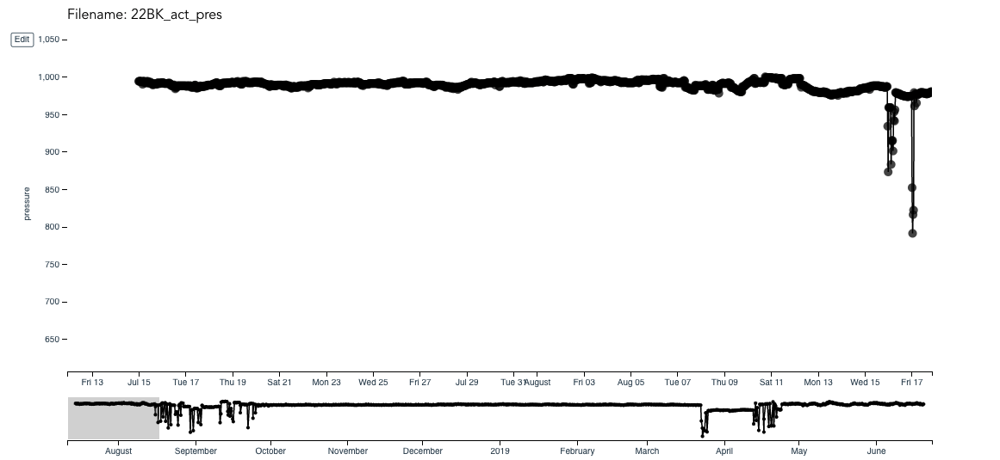
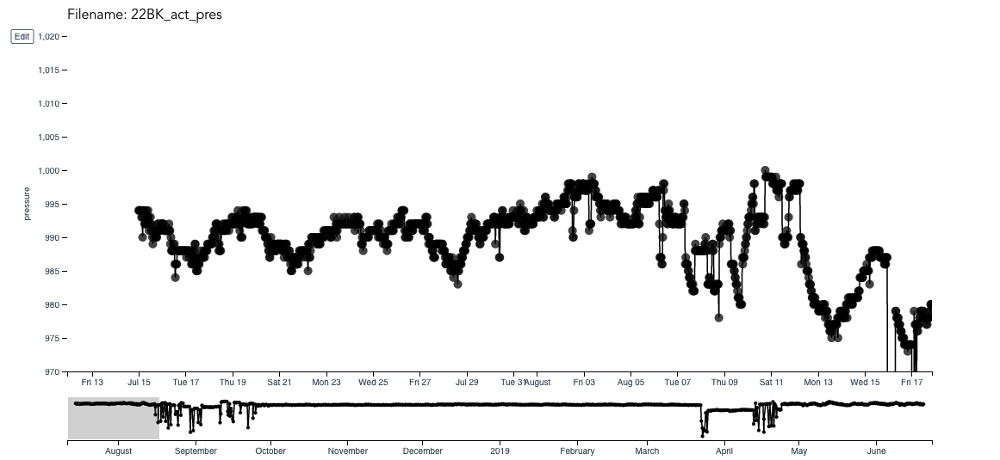
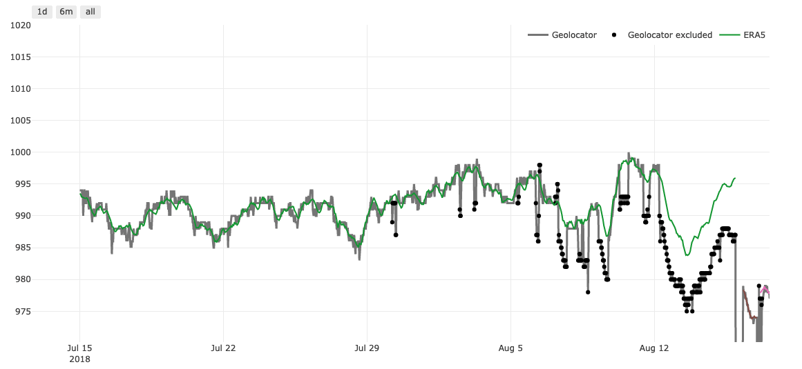
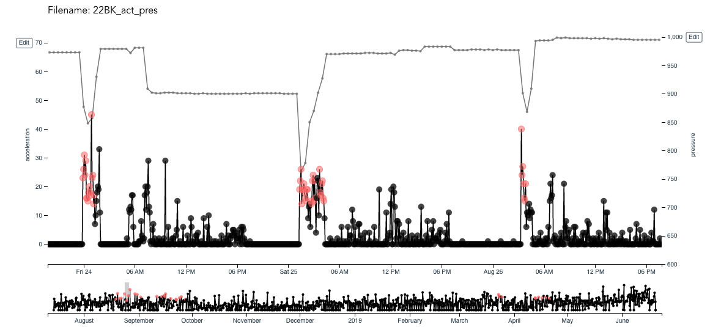
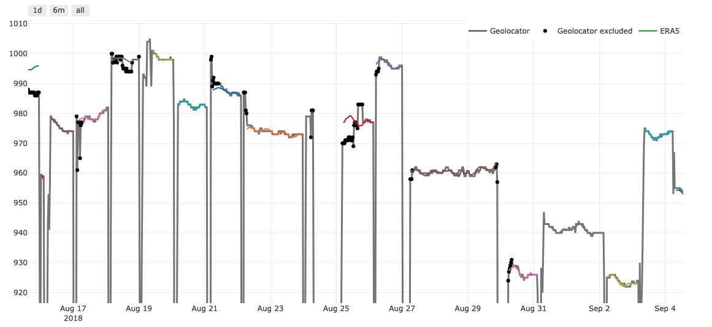
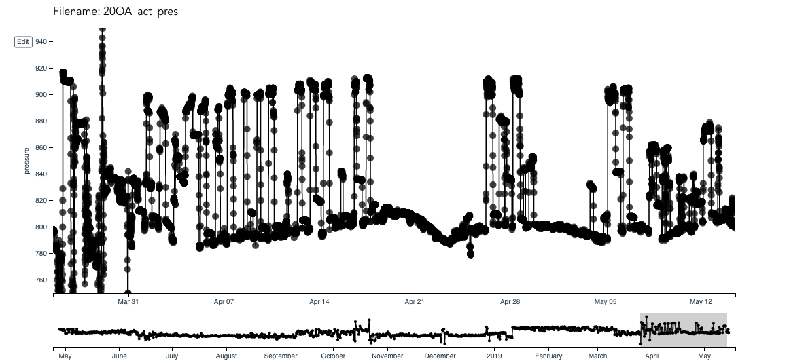
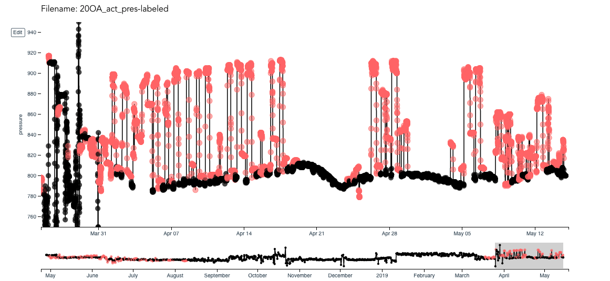
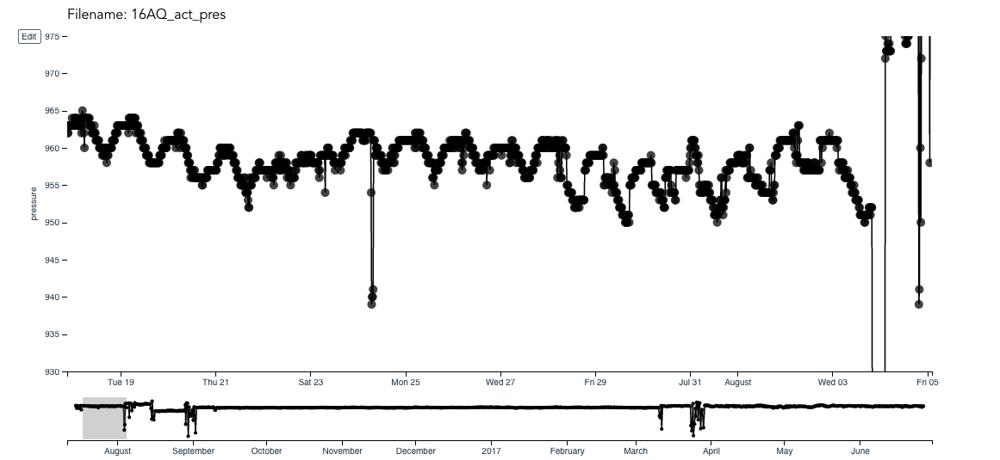
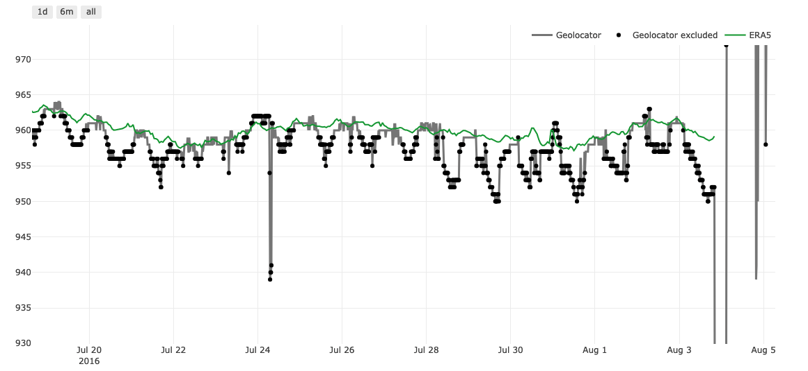
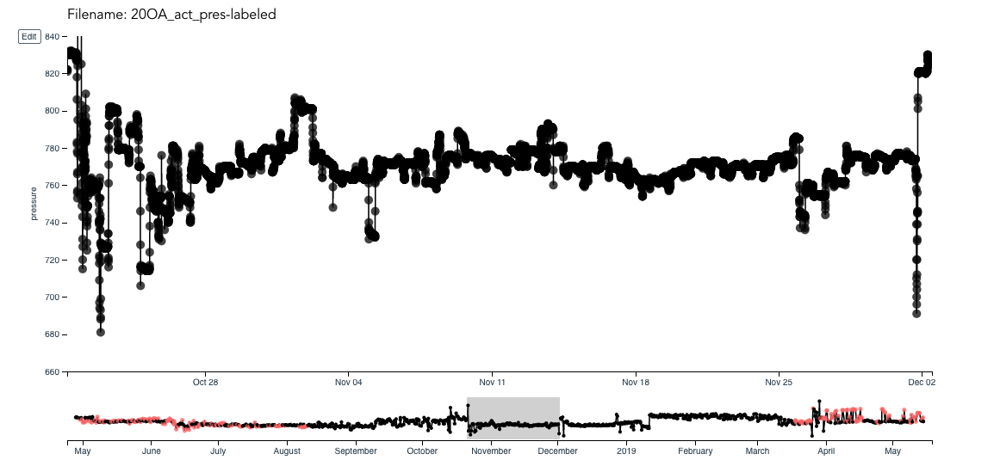

```{r, include = FALSE}
knitr::opts_chunk$set(
  warning = FALSE,
  message = FALSE,
  collapse = TRUE,
  comment = "#>"
)
```

In this vignette, we explore how to label your track files (activity and pressure) and provide tips to make the exercise more efficient. To see where this exercise fits in with the overall process, see the vignette [How to use GeoPressureR](using-geopressurer.html).

```{r setup}
library(GeoPressureR)
library(raster)
library(plotly)
library(RColorBrewer)
pam_data <- pam_read(
  pathname = system.file("extdata", package = "GeoPressureR"),
  crop_start = "2017-06-20", crop_end = "2018-05-02"
)
```


## Motivation

The most important reason motivating manual editing is that **pressure mapping relies on precise activity and pressure data**. Activity labelling defines stationary periods and flight duration. Short stationary periods can be particularly hard to define, such that expert knowledge is essential. Since flight duration is the key input in the movement model, having an accurate flight duration is critical to correctly estimate the distance traveled by the bird between two stationary periods. The pressure timeseries matching algorithm is highly sensitive to erroneously labeled pressure, such that even a few mislabeled datapoints can throw off the estimation map. 

Each species' migration behaviour is so specific that **manual editing remains the fastest option**. You can expect to spend between 30sec (e.g. Mangrove Kingfisher) to 10min (e.g. Eurasian Nightjar) per track depending on the species' migrating complexity.

**Manual editing also provides a sense of what the bird is doing**. You will learn how the bird is moving (e.g. long continuous high altitude flight, short flights over multiple days, alternation between short migration flights and stopovers, etc.). It also provides a sense of the uncertainty of your classification, which is useful to understand and interpret your results. 

That being said, it is still worth starting the manual editing from an automatically labeled timeseries. `pam_classify()` defines migratory flight when activity is hight for a long period. Refer to possible classification methods on the [PAMLr manual](https://kiranlda.github.io/PAMLrManual/index.html).

```{r eval=F}
pam_data <- pam_classify(pam_data, min_duration = 30)
trainset_write(pam_data, pathname = system.file("extdata", package = "GeoPressureR"), filename = "18LX_act_pres-labeled-v1.csv")
```

## Basic labelling principles

The procedure involves labelling (1) migratory activity as `1` and (2) identifying pressure datapoints to be discarded from the matching exercise with `1`.

The outcome of the activity labelling is twofold:

1. defined stationary periods, during which the bird is considered static relative to the size of the grid (~10-30km). The start and end of the stationary period is then used to define the pressure timeseries to be matched. 
2. defined flight duration, which is used in the movement model and, indirectly, impact the distance between stationary periods.

Labelling of pressure allows to deal with situations when the bird is changing altitude. Since the reanalysis data to be matched is provided at ground level, the geolocator's pressure series should be at a single elevation and therefore we must discard all data points from a different elevation.

## Introduction to TRAINSET

We are suggesting to use TRAINSET, a web based graphical tool for labelling time series. You can read more about TRAINSET on [www.trainset.geocene.com](https://trainset.geocene.com/) and [on their Github](https://github.com/Geocene/trainset). 


The tool interface is quite intuitive. Start by uploading your .csv file (e.g., `18IC_act_pres.csv`).

{width=100%}

A few tips:

- **Keyboard shortcuts** can considerably speed up navigation (zoom in/out, move left/right) and labelling (add/remove a label), specifically with `SHIFT`.
- Because of the large number of datapoints, keeping a narrow temporal window will avoid your browser from becoming slow or irresponsive.
- You can change the **"Reference Series"** to pressure to see both timeseries at the same time which is helps interpret what the bird is doing.
- Play with the **y-axis range** to properly see small pressure variations which may not be visible at full range.
- TRAINSET is offers more flexibility with the label than required: you can add and remove label values (bottom-right of the page). In order for `trainset_read()` to work, do not change/edit/add any label, simply use the ones offered : `0` and `1`.


## Four tests to check labelling

To assess the quality of your labeling, you can use this script comprising of four basic tests.

### Test 1: Duration of stationary periods and flights

The first test consists in checking the duration of flights and stationary periods.

```{r}
pam_data <- trainset_read(pam_data, system.file("extdata", package = "GeoPressureR"), filename = "18LX_act_pres-labeled-v1.csv")
pam_data <- pam_sta(pam_data)
pam_data$sta$duration <- difftime( pam_data$sta$end, pam_data$sta$start, units = "days")
pam_data$sta$next_flight_duration <- c(difftime(tail(pam_data$sta$start, length(pam_data$sta$start) - 1), 
                                                   head(pam_data$sta$end, length(pam_data$sta$end) - 1), units = "hours"),0)
knitr::kable(subset(pam_data$sta,duration<0.25| next_flight_duration < 1))
```

You may want to check the labelling of flights shorter than one hour as well as the labelling before and after stationary periods shorter than a couple of hours. Using the exact times from the table above, you can edit your labelling in TRAINSET and export a new version of the `csv` file. Note that the last row has a `next_flight_duration` of 0 because it is the last stationary period. 

### Test 2: Pressure timeseries

The second check to carry out before computing the map is to visualize the pressure timeseries and their grouping into stationary periods.

```{r}
pam_data <- trainset_read(pam_data, system.file("extdata", package = "GeoPressureR"), filename = "18LX_act_pres-labeled-v2.csv")
pam_data <- pam_sta(pam_data)

# Set colorscale
col <- rep(RColorBrewer::brewer.pal(9, "Set1"), times = ceiling((nrow(pam_data$sta)+1)/9))
col <- col[1:(nrow(pam_data$sta)+1)]
names(col) <- levels(factor(c(0,pam_data$sta$sta_id)))

pressure_na <- pam_data$pressure
pressure_na$obs[pressure_na$isoutliar | pressure_na$sta_id==0]=NA
p <- ggplot() +
  geom_line(data = pam_data$pressure, aes(x = date, y = obs), col = "grey") +
  geom_line(data = pressure_na, aes(x = date, y = obs, col = factor(sta_id))) +
  geom_point(data = subset(pam_data$pressure, isoutliar), aes(x = date, y = obs), colour = "black") +
  theme_bw() + scale_colour_manual(values = col) + scale_y_continuous(name = "Pressure(hPa)")
  
ggplotly(p, dynamicTicks = T) %>% layout(showlegend = F)
```

Ploting this figure with [Plotly](https://plotly.com/r/) allows you to zoom-in and pan to check all timeseries are correctly grouped. Make sure each stationary period does not include any pressure measurement from flight (e.g. 1-Sep-2017 in the figure above). You might spot some anomalies in the temporal variation of pressure. In some cases, you can already label the pressure timeseries to remove them.

### Test 3: Pressure timeseries match

So far, we have checked that the pressure timeseries are correctly labeled with their respective stationary periods and that they look relatively smooth. At this stage, the timeseries are good enough to be matched with the reanalysis data. The third test consists of finding the location with the best match and comparing the pressure timeseries. This allows to distinguish bird movements from natural variations in pressure. This is by far the most difficult step, and multiple iterations will be necessary to achieve the best results. 

It is important to understand the location with the best match is probably quite wrong for all the short stationary period at this stage. But the point of this exercise is to locate change in location (new stationay period) and vertical movement of the bird, thus the location doesn't matter. We search to differentiate natural variation of pressure from those related to bird movement. 

As computation can take time, we recommend starting with a few long stationary periods, and once results are satisfying, moving to the shorter periods.

```{r}
pam_data <- trainset_read(pam_data, system.file("extdata", package = "GeoPressureR"), filename = "18LX_act_pres-labeled-v3.csv")
pam_data <- pam_sta(pam_data)

sta_id_keep <- pam_data$sta$sta_id[difftime(pam_data$sta$end, pam_data$sta$start, units = "hours") > 12]
pam_data$pressure$sta_id[!(pam_data$pressure$sta_id %in% sta_id_keep)] <- NA
message("Number of stationay period to query: ", length(sta_id_keep))
```

We can estimate the probability map for each stationary period with the following code. We will cover these fours functions in more details in the vignette [Pressure Map](articles/pressure-map.html). For each stationary period, we locate the best match and query the pressure timeseries with `geopressure_ts()` at this location.

```{r, eval = F}
pressure_maps <- geopressure_map(pam_data$pressure, extent = c(50, -16, 0, 23), scale = 10, max_sample = 100)
pressure_prob <- geopressure_prob_map(pressure_maps)
path <- geopressure_map2path(pressure_prob)
pressure_timeserie <- geopressure_ts_path(path, pam_data$pressure)
```
```{r, include=F}
load(system.file("extdata", "18LX_pressure_timeserie.Rda", package = "GeoPressureR"))
```

We can now look at a similar figure of pressure timeseries, but this time comparing geolocator data with the best match from the reanalysis data. 

```{r}
p <- ggplot() +
  geom_line(data = pam_data$pressure, aes(x = date, y = obs), colour = "grey") +
  geom_point(data = subset(pam_data$pressure, isoutliar), aes(x = date, y = obs), colour = "black") +
  geom_line(data = do.call("rbind", pressure_timeserie), aes(x = date, y = pressure0, col = factor(sta_id))) +
  theme_bw() + scale_colour_manual(values = col) + scale_y_continuous(name = "Pressure(hPa)")

ggplotly(p, dynamicTicks = T) %>% layout(showlegend = F)
```

You can use this figure to identify periods where the mismatch indicates a problem with the labelling. Often, it will indicate that the bird was changing altitude. This happens regularly during migration, the bird lands in one location and performs one or two short flights in the morning, resulting in a change in altitude. Activity data on TRAINSET can also help understand what the bird is doing.

In this example, removing a few more pressure datapoints can improve the match, especially for short stopover (e.g. 2017-9-11). See below for the final labeled file.

```{r}
pam_data <- trainset_read(pam_data, system.file("extdata", package = "GeoPressureR"), filename = "18LX_act_pres-labeled.csv")
pam_data <- pam_sta(pam_data)

p <- ggplot() +
  geom_line(data = pam_data$pressure, aes(x = date, y = obs), colour = "grey") +
  geom_point(data = subset(pam_data$pressure, isoutliar), aes(x = date, y = obs), colour = "black") +
  geom_line(data = do.call("rbind", pressure_timeserie), aes(x = date, y = pressure0, col = factor(sta_id))) +
  theme_bw() +
  theme_bw() + scale_colour_manual(values = col) + scale_y_continuous(name = "Pressure(hPa)")

ggplotly(p, dynamicTicks = T) %>% layout(showlegend = F)
```

### Test 4: Histogram of pressure error

Finally, you can also look at the histogram of the pressure error (geolocator-ERA5). 
For long stationary periods (over 5 days), you want to check that there is a single [mode](https://en.wikipedia.org/wiki/Mode_(statistics)) in your distribution. Two modes indicate that the bird is spending time at two different altitudes. This is usual when birds have a day site and a night roost at different elevations. 
You might also want to check the spread of the distribution. This value can guide you in setting the standard deviation parameter `s` in `geopressure_prob_map()`.

```{r}
par(mfrow = c(5, 6), mar = c(1, 1, 3, 1))
for (i_r in seq_along(pressure_timeserie)) {
  i_s <- unique(pressure_timeserie[[i_r]]$sta_id)
  df3 <- merge(pressure_timeserie[[i_r]], subset(pam_data$pressure, !isoutliar & sta_id == i_s), by = "date")
  df3$error <- df3$pressure0 - df3$obs
  hist(df3$error, main = i_s, xlab = "", ylab = "")
  abline(v = 0, col = "red")
}
```

## Common challenges and tips to address them

In the following section, we use examples to illustrate common challenges that may be encountered during manual editing, and offer suggestions on how to address them. 

### Outliars during flights due to low bird activity

During a flight, single activity measurements can display low activity due to e.g. short gliding flights with no flapping. The automatic labelling of activity with the KNN classifier may mislabel these points as stationary periods, as illustrated in the example below for the night of the 31st of August. A single mislabeled point can incorrectly split the flight into multiple short flights. This error is highlighted with Test #1 described above. However, birds may also display lower activity at the beginning or end of their flight, which is often misclassified, as illustrated in all three nights in the example below and would not be picked up by Test #1.

{width=100%}

However, if the low activity happens well before the bird reaches the ground, as illustrated in the example below, the low pressure measurement of flight will be included in the stationary period. These error can sometimes be pick-up in Test #2. Yet this is worth checking all flights activity and assess on a case-by-case basis whether this such datapoints should be included in the flight or not. 

{width=100%}

### Importance of zooming in before editing outliers

Anomalies in a pressure timeseries might not be obvious at first sight.

{width=100%}

Zooming in to narrower pressure range helps to understand what is happening. In this example, we have a Tawny Pipit breeding near a mine site with a rough topography. While breeding, it looks like it is staying at a relatively constant elevation, but the sudden drop in pressure towards the end indicates that the bird has changed altitude.

{width=100%}

In such cases, the aim is to discard all pressure datapoints recorded while the bird was at a different altitude. It may not always be obvious to distinguish temporal variation of pressure from when the bird actually changes altitude. We suggest keeping only the datapoints that you are confident with (here, the first part of the timeseries only) and running Test #3.  

{width=100%}

With a long timeseries such as this one, Test #3 will easily pick up the right location and the timeseries that you want to match. You can simply de-select the datapoints at the end of your timeseries that fit the ERA5 green line. For shorter timeseries, you might need several iterations to pick up the correct match.

### Short stationary halts between flights

Interpreting bird behaviour and defining stationary periods can be difficult, for example when birds extend their migration into the day but with lower intensity, such that the end of flight is not clear. 

{width=100%}

In other cases, the bird stops for a couple of hours and then seems to be active again. This could be low-intensity migratory movement, a short break followed by more migratory flight, or landing at the stopover location, but relocating early morning with the light.

{width=100%}

The question is whether to label these halts as stationary periods or not. 

Referring to the pressure timeseries can help assess whether the bird changes location. For example, if the low activity is followed by high activity accompanied by pressure change, we can consider that the bird then changed location, and label the low activity as a stationary period. 

However, the bird may also land and then complete local flights within its stopover location (with very little pressure variation), in which case we want to avoid creating two different stationary periods. 

Test #3 helps ensure that no local vertical movements took place. 

{width=100%}

###	Mountainous species
Mountainous species display very specific behaviour with regular altitudinal changes. 

This is very clear with the Ring Ouzel’s timeseries, which displays daily occurring movements, though not regular enough to make the process automatic, and sometimes changing in altitude. At this scale, it is difficult to assess the temporal variation of pressure, both the 790hPa and 900hPa pressure level might work, such that it is difficult to know which points to discard.

{width=100%}
At this point it can help to zoom out on the time axis to see whether a certain elevation seems most common. Then proceed iteratively to keep only the datapoints at the same elevation. Test #4 is useful to ensure you did not forget any points.

{width=100%}

{width=100%}

The Eurasian Hoopoe presents more of a challenge as it moves continuously throughout the day, showing a more sinosoidal pattern. 

{width=100%}
This is the most challenging case as distinguishing temporal variation from altitudinal change is difficult. 

{width=100%}
Several iterations should lead to a relatively smooth pressure timeseries. Note that in order to estimate the uncertainty correctly for such cases, the standard deviation `s` should be increased. Thankfully, this behaviour is restricted to its breeding ground. 

{width=100%}

In some cases, finding a single timeseries is impossible, such as for the wintering site of this Ring Ouzel, never returning to the same elevation. In such cases, we discard the entire timeseries and use only the mask of absolute pressure values. 

{width=100%}

Luckily, by definition mountainous species live in specific areas, which restricts possible locations. In this case, based on previous stationary periods we can establish that the bird was in Morocco, and with such low pressure (i.e. high elevation), only the Atlas mountains fit the pressure mask.

{width=50%}


## Example
```{css, echo=FALSE}
#loader {
    border: 4px solid #f3f3f3; /* Light grey */
    border-top: 4px solid #3498db; /* Blue */
    border-radius: 50%;
    width: 12px;
    height: 12px;
    animation: spin 2s linear infinite;
    display: inline-block;
    vertical-align: top;
  }
  
  @keyframes spin {
    0% { transform: rotate(0deg); }
    100% { transform: rotate(360deg); }
  }
```
<link rel="stylesheet" href="https://raw.githubusercontent.com/Rafnuss/GeoPressureMAT/main/html/AllTracksPressureWithReanalysis.css">
<label for="track">Choose a track:</label>
<select id="track">
    <option value='18IC'>Great Reed Warbler (18IC)</option><option value='18LX'>Great Reed Warbler (18LX)</option><option value='22BK'>Tawny Pipit (22BK)</option><option value='22BN'>Tawny Pipit (22BN)</option><option value='22KT'>Eurasian Nightjar (22KT)</option><option value='24FF'>Eurasian Nightjar (24FF)</option><option value='24TA'>Red-capped Robin-Chat (24TA)</option><option value='24UL'>Mangrove Kingfisher (24UL)</option><option value='16LP'>Woodland Kingfisher (16LP)</option><option value='20IK'>Woodland Kingfisher (20IK)</option><option value='22QL'>Eurasian Wryneck (22QL)</option><option value='22QO'>Eurasian Wryneck (22QO)</option><option value='20OA'>Ring Ouzel (20OA)</option><option value='20OE'>Ring Ouzel (20OE)</option><option value='16AQ'>Eurasian Hoopoe (16AQ)</option><option value='16DM'>Eurasian Hoopoe (16DM)</option>
</select>
<div id="loader"></div>
<div id="plotlyID" style="width:100%;height:500px;"></div>
<!--<script src="https://cdnjs.cloudflare.com/ajax/libs/plotly.js/1.33.1/plotly-basic.min.js"></script>-->
<script src="https://raw.githubusercontent.com/Rafnuss/GeoPressureMAT/main/html/AllTracksPressureWithReanalysis.js"></script>
<a href="https://raphaelnussbaumer.com/GeoPressureMAT/html/AllTracksPressureWithReanalysis.html">View in full screen</a>


## Future improvements

A lot can be done to improve this process:

- Run TRAINSET offline
- Bypass the create/upload/read csv by running a browser session directly in R
- Build an R (shiny) equivalent of TRAINSET to be directly integrated with the R package, but unable to find a good package to label points in a Figure in R, would have to maintain it, while TRAINSET does this for free. 
- Any suggestions? [Write an issue on Gitub](https://github.com/Rafnuss/GeoPressureR/issues/)
