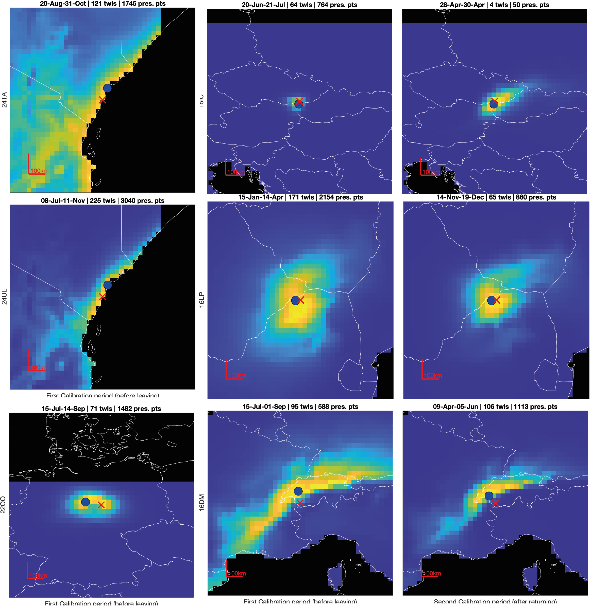

```{r, include = FALSE}
knitr::opts_chunk$set(
  collapse = TRUE,
  comment = "#>"
)
```


At the core of GeoPressure, we try to estimate the position of the bird based on a pressure mismatch of the geolocator and a weather reanalysis dataset ([ERA5](https://www.ecmwf.int/en/forecasts/datasets/reanalysis-datasets/era5)). A major challenge in this process is the transformation of map of errors (mismatch) into a probability.

In this vignette, we will explore this challenge, look at the theory behind it and explore possible solution using Great Reed Warbler (18IC) as an example. 

## Problem presentation

For each stationary period, we estimate the probability of the position $\textbf{x}$ of the bird based on a pressure timeseries measured by the geolocator $P_{gl}[t] \quad \forall t \in [1,\ldots,n]$, which in a Bayesian framework can be written as, 
$$p(\textbf{x}\mid P_{gl}[1],\ldots,P_{gl}[n]) \propto p(P_{gl}[1],\ldots,P_{gl}[n] \mid \textbf{x}) p(\textbf{x}).$$

We are interested here in determining the likelihood term $p(P_{gl} \mid \textbf{x})$ which represents the probability of observing the timeseries $P_{gl}$ knowing that the bird is at location $\textbf{x}$. To quantify this probability, we look at the mismatch between $P_{gl}$ and the pressure timeseries of the ERA5 database $P_{ERA5}(\textbf{x})$ extracted at location $\textbf{x}$. We can reformulate the likelihood as as a probability function $f$ of an error term $\varepsilon(\textbf{x})$ which measures a distance between $P_{gl}$ and $P_{ERA5}(\textbf{x})$
$$p(P_{gl} \mid \textbf{x}) = f(\varepsilon[1],\ldots,\varepsilon[n])$$

This formulation of the problem helps us to split our problem in two: first defining an error term $\varepsilon[t]$ and secondly defining the likelihood function $f$.

## Error term
In most cases, we would expect to measure the error term with a simple difference $P_{ERA5}(\textbf{x})[t]-P_{gl}[t].$ However, within a ERA5 grid cell of 9-30km, we can expect a wide range of altitude at which the bird can be located. As such any offset between the two timeseries might be due to nothing more than a difference of altitude.

To solve this issue, we remove the mean pressure difference, essentially ignoring the absolute value of pressure (and altitude) such that the error term only quantify the mismatch of the temporal variation, 
$$\varepsilon[t] = \left( P_{ERA5}(\textbf{x})[t]-P_{gl}[t]\right) - \left( \frac{1}{n}\sum_{i=1}^{n} P_{ERA5}(\textbf{x})[i]-P_{gl}[i] \right) .$$

This way of building the error term has some important consequences. A timeseries of only one datapoint will always yield zero error at all locations, resulting in an equally probable map. As the number of datapoints increases, the error term will become more and more able to distinguish between "good" and "bad" locations.

## Error term for the Great Reed Warbler

Let's load the data and compute basic operation (see [How to use GeoPressureR](using-geopressurer.html) for more information).

```{r setup}
library(raster)
library(GeoPressureR)
pam_data <- pam_read(system.file("extdata", package = "GeoPressureR"),
  crop_start = "2017-06-20", crop_end = "2018-05-02"
)
pam_data <- trainset_read(pam_data, system.file("extdata", package = "GeoPressureR"))
pam_data <- pam_sta(pam_data)

sta_id_keep <- pam_data$sta$sta_id[difftime(pam_data$sta$end, pam_data$sta$start, units = "hours") > 12]
pam_data$pressure$sta_id[!(pam_data$pressure$sta_id %in% sta_id_keep)] <- NA
```

We are using [the GeoPressure API](https://raphaelnussbaumer.com/GeoPressureServer/#description) with the `geopressure_map()` function to measure the mismatch of the pressure series. Because the API can realistically return only a single map per stationary period, it aggregates the error timeseries with the Mean Squared Error (MSE), 
$$\mathit{MSE} = \frac{1}{n}\sum_{t=1}^{n} \varepsilon[t]^2.$$
```{r, include=F}
pressure_maps <- readRDS(system.file("extdata", "18LX_pressure_maps.rda", package = "GeoPressureR"))
```

We can post-process the data to get back some basic metadata, such as the number of datapoints of each stationay period used. We also compute the position with the minimum MSE

```{r}
sta <- data.frame()
raster_mse_list <- c()
for (i_s in 1:length(pressure_maps)) {
  # get MSE layer
  raster_mse_list[[i_s]] <- pressure_maps[[i_s]][[1]]
  # change 0 (water) in NA
  raster_mse_list[[i_s]][raster_mse_list[[i_s]] == 0] <- NA

  # Acess geotiff metadata
  mt <- raster::metadata(pressure_maps[[i_s]])

  mt$start <- mt$extend_sample[1]
  mt$end <- mt$extend_sample[2]
  tmp <- as.data.frame(raster_mse_list[[i_s]][[1]], xy = T)
  mt$lon <- tmp$x[which.min(tmp[, 3])]
  mt$lat <- tmp$y[which.min(tmp[, 3])]

  sta <- rbind(sta, as.data.frame(mt[-4]))
}
knitr::kable(head(sta))
```

## Gaussian likelihood function

In order to find an appropriate likelihood function, we first need to assume a distribution of the error. The sources of the errors are (1) the sensor measurement error, (2) the ERA5 reanalysis error and (3) the attitudinal movement of the bird during this time. Because we are removing the mean error, we can ignore any long-term errors (e.g., constant temporal error in ERA5 or biases in the geolocator sensor). 

The figure below shows the error distribution at the known location of equipment and retrieval.

{width=100%}
 They all look close enough to a Gaussian distribution. In the case of the Great Reed Warbler, the standard deviation is around 0.5.
 
```{r}
s <- 0.5
```

Therefore, assuming a gaussian distribution of our error, the [Gaussian likelkhood](https://en.wikipedia.org/wiki/Maximum_likelihood_estimation#Non-independent_variables)  of a multivariate normal distribution is given by 
$$ f(\boldsymbol{\varepsilon})={\frac {1}{(2\pi)^{n/2} \sqrt{\det(\boldsymbol{\Sigma})}}}\exp \left(-\frac{1}{2} \boldsymbol{\varepsilon} \boldsymbol{\Sigma}^{-1} \boldsymbol{\varepsilon} \right).$$
with the vector notation $\boldsymbol{\varepsilon }=[\varepsilon[1],\ldots,\varepsilon[n]]$ and where the covariance matrix $\boldsymbol{\Sigma}$ contains the variance of two datapoints $\boldsymbol{\Sigma}_{t_1,t_2} = \operatorname {E}[ \varepsilon[t_1] \varepsilon[t_2] ]$.

## Independance of errors

As the covariance is difficult to quantify explicitly, we can first look at the very strong assumption of independance of the error, $\varepsilon_t \overset{i.i.d.}{\sim} \mathcal{N}(0,\sigma)$. In this case, the [Gaussian likelkhood function](https://en.wikipedia.org/wiki/Maximum_likelihood_estimation#Continuous_distribution,_continuous_parameter_space) $f_{ind}$ is simply the product of the normal probability density function of each error $\varepsilon[t]$, 
$$ f_{ind}(\boldsymbol{\varepsilon})=\prod _{t=1}^{n}f_\mathcal{N}(\varepsilon[t])=\left({\frac {1}{2\pi \sigma ^{2}}}\right)^{n/2}\exp \left(-{\frac {\sum _{t=1}^{n}\varepsilon[t]^2}{2\sigma ^2}}\right).$$

We can re-write this equation as a function of the MSE
$$ f_{ind}(\boldsymbol{\varepsilon})=\left({\frac {1}{2\pi \sigma ^{2}}}\right)^{n/2}\exp \left(-n{\frac {\mathit{MSE}}{2\sigma ^2}}\right).$$

Using this equation, we can compute the probability for each stationary periods. In the code below, we define a likelihood function `f_prob` as a function of $n$, $\sigma$ and the MSE.
```{r}
f_prob <- function(n, s, MSE) {
  (1 / (2 * pi * s^2))^(n / 2) * exp(-n * MSE / 2 / s^2)
}
```

We define a function below to display the MSE and probability for 8 stationary periods based on a likelihood function. This function will be used later to compare with other likelihood function.

```{r}
fun_plot_prob <- function(f_prob, sta, pressure_maps) {
  raster_prob_list <- c()
  for (i_s in 1:length(pressure_maps)) {
    n <- sta$nb_sample[i_s]
    raster_prob_list[[i_s]] <- f_prob(n, s, raster_mse_list[[i_s]])
  }
  iis <- c(1, 2, 5, 17, 24, 26)
  sta[iis, ]
  dl <- 5
  par(mfcol = c(2, length(iis)), mar = c(0, 0, 7, 0), mai = c(0, 0, .1, 0))
  for (i_s in iis) {
    plot(raster_mse_list[[i_s]],
      main = paste0("MSE|i_s=", i_s, "|n=", sta$nb_sample[i_s]),
      horizontal = TRUE,
      axes = FALSE,
      legend.shrink = .8,
      xlim = c(sta$lon[i_s] - dl, sta$lon[i_s] + dl), ylim = c(sta$lat[i_s] - dl, sta$lat[i_s] + dl)
    )
    points(sta$lon[i_s], sta$lat[i_s])
  }
  for (i_s in iis) {
    plot(raster_prob_list[[i_s]],
      main = "Prob",
      horizontal = TRUE, axes = FALSE, legend.shrink = .8,
      xlim = c(sta$lon[i_s] - dl, sta$lon[i_s] + dl), ylim = c(sta$lat[i_s] - dl, sta$lat[i_s] + dl)
    )
    points(sta$lon[i_s], sta$lat[i_s])
  }
}
```

```{r}
fun_plot_prob(f_prob, sta, pressure_maps)
```

Assuming independance, the gaussian likelihood transforms the MSE into probability with narrow ranges of uncertaintie. So narrow that for long stationary period (i_s=1 and 17), the enterie map is 0.

This comes from the multiplication of probability assumed in the independence case (see equation above). The underlying assuming of the mulitplication operator is the [conjunction of probabilities](https://en.wikipedia.org/wiki/Logical_conjunction), where aggregating two information is done with the AND operator: $P(A~\text{and}~B) = P(A)\times P(B)$. Only the information content overlaping every datapoint of information is kept. 

## Quantifying the dependance of errors

Ploting the auto-covariance at the calibration site for all the species allow us to see a temporal pattern in the error. For most bird, we can see a clear daily fluctuation which is certainly due to the bird daily movement for commute between feeding and roosting site. The auto-covariance is approaching 0 for all birds, which is expected as we removed the mean value. However, the [sill](https://en.wikipedia.org/wiki/Variogram) is reached between 6hours and 12 hours depending on birds (Hoopoe doesn't reach it after 3 days!).

{width=100%}

From this observation, one option would be to construct a covariance matrix based on the auto-covariance. While this would look like the cleanest way of doing it, we have two issues. 

1. The first one is the absence of stationarity. Indeed, the auto-covariance amplitude (and potentially shape) is strongly influenced by the vertical displacement of the bird, which is strongly correlated with topography. For instance, the Eurasian Hoopoe has a high variance and large temporal range because it breeds at the feet of the Alps. During the rest of the year, it lives in rather flat area. Therefore, the covariance built from the breeding site would not be appropriate for the other sites. 
2. The second issue has to do with the definition of our error term and the different duration of stationary period. 


## Probability aggregation

In the rest of this vignette, we will take a different angle, re-framing the problem differently and exploring other options to compute the likelihood.

In the field of [probability aggreation](https://link.springer.com/article/10.1007/s11004-012-9396-3), the problem of combining sources of information with overlapping/redundant content is frame as finding a pooling operator $F$ such that,
$$p(\textbf{x}\mid \varepsilon[1],\ldots,\varepsilon[n]) \approx F(p(\textbf{x} \mid \varepsilon[1]) ,\ldots,p(\textbf{x} \mid \varepsilon[n])),$$
which, with our gaussian assumption, we can written,
$$ F(f(\varepsilon[1]),\ldots,f(\varepsilon[n]))=F(\boldsymbol{\varepsilon})$$

## Introduction to Log-linear pooling

The most popular aggregation function is the log-linear pooling,

$$F(\boldsymbol{\varepsilon}) \propto \prod_{t=1}^n f(\varepsilon[t])^{w_t}$$

This equation also relies on the principle of conjuction of probability, but it uses a weight $w_t$ which is related to the new information brought by each additional $\varepsilon[t]$. Formally, it can be defined by
$$w_t=\frac{\ln p(\varepsilon[t] \mid \boldsymbol{x},\varepsilon[1],\ldots \varepsilon[t-1])}{\ln p(\varepsilon[t] \mid \boldsymbol{x})}.$$
[Allard et al. (2012)](http://link.springer.com/10.1007/s11004-012-9396-3) is a great resource to learn more about probability aggregation and log linear pooling.

The log-linear pooling aggregation simplifies to the case of Gaussian independence when $w_t=1$. We have already explored this case earlier.

In the more general case, using the Gaussian probability density function formula, we can write,
$$f(\varepsilon[t])^{w_t} = \left({\frac {1}{2\pi \sigma ^{2}}}\right)^{w_t/2}\exp \left(-w_t{\frac {\varepsilon[t]^2}{2\sigma ^2}}\right).$$

As such, if we assume the weight to be constant $w_t=w$, we can rewrite the pooling aggregator as
$$F(\boldsymbol{\varepsilon}) \propto \left({\frac {1}{2\pi \sigma ^{2}}}\right)^{\frac{wn}{2}} \exp \left(-{\frac {w}{2\sigma ^2}}\sum _{t=1}^{n}\varepsilon[t]^2\right),$$

and even write it as a function of the MSE,
$$F(\boldsymbol{\varepsilon}) \propto \left({\frac {1}{2\pi \sigma ^{2}}}\right)^{\frac{wn}{2}} \exp \left(-{\frac {wn}{2\sigma ^2}}\textit{MSE}\right).$$

## Log-linear pooling, $w=1/n$

An interesting case is if $w=1/n$, so that $\sum_t w_t=1$. This would simplify the log-linear pooling aggregator to
$$ F(\boldsymbol{\varepsilon})={\frac {1}{\sigma\sqrt{2\pi} }}\exp \left(-{\frac {1}{2\sigma ^2}\mathit{MSE}}\right),$$
which can be interpreted as the Gaussian probability distributions of the MSE. The length of the timeseries $n$ has disappeared from the equation, so that the aggregation dependence only on the mean square of the errors, regardless of how many datapoints.

We can try this and see the influence on the probability map.

```{r}
f_prob <- function(n, s, x) {
  w <- 1 / n
  (1 / (2 * pi * s^2))^(n * w / 2) * exp(-w * n / 2 / (s^2) * x)
}
fun_plot_prob(f_prob, sta, pressure_maps)
```

As expected from the disappearance of n, the uncertainty is now completely independent from the duration of the stationary period.

This is again obviously not what we want, but it shows the other extreme of the log-linear pooling.

## Log-linear pooling, $w = \log(n)/n$

For this study, we chose to use $w=\frac{\log(n)}{n}$, which result in the pooling aggregation

$$F(\boldsymbol{\varepsilon}) \propto \left({\frac {1}{2\pi \sigma ^{2}}}\right)^{\frac{w\log(n)}{2}} \exp \left(-{\frac {\log(n)}{2\sigma ^2}}\textit{MSE}\right).$$

This scheme was designed to minimize the strength of $1/n$

```{r}
f_prob <- function(n, s, x) {
  w <- log(n) / n
  (1 / (2 * pi * s^2))^(n * w / 2) * exp(-w * n / 2 / (s^2) * x)
}
fun_plot_prob(f_prob, sta, pressure_maps)
```

## Validation

Validation of uncertainty estimation is relatively difficult, especially when there are only a few datapoints and we assume that the behaviour of the bird might differ between calibration sites (equipement and retrival) and the rest of its journey. 

In the figure below, some examples of uncertainty estimate are shown. Ideally, we want the colored area to be small (low uncertainty), but when assessing an uncertainty, we also want the red cross to fall within the colored area. That is, if the red cross is too often outside, our estimator is too confident.

Furthermore, the shape of the uncertainty can be strongly anisotripic (e.g., hoopoe bottom right) making the distance between the most likely point (blue) and true value (red cross) a poor measure of uncertainty. 

{width=100%}

Assessing uncertainty relies on checking that that the red cross is distributed according to each uncertainty shape. A more formal way to quantifiying the uncertainty is of the quantile of the true value $q=p(\boldsymbol{x}\leq \boldsymbol{x}_{true})$, which corresponds to the proability that the variable is less than or equal to the true value. So, if the true value belongs to the distribution, the distribution of its quantile should be uniform.

This can be visualize with the empirical cumulative distribution of the quantiles which should fall on the 1:1 line (like a qq-plot). The two extreme cases ($w=1$ and $w=1/n$) show overconfidence (above the line) and  underconfidence (below the line) respectively. Indeed, the distribution of quantile using the $w=1/n$ method shows a lot of quantile values between 0.9-1, which indicates that the true value is within the 90% uncertainty contour (underconfident).


{width=100%}

The method chosen ($w=\log(n)/n$) is doing better than both, but is still in general underconfident. Because the calibration the validation is performed with rather long temporal serie (equipement and retrival), one can expect that the labelisation of pressure is better/easier than for other places. Thus, it seems more appropriate to be slightly underconfident while the method is being developed. 

The covariance aggregation scheme was implemented by computing the covariance matrix of the multi-variate Gaussian distribution. The covariance function was build using the exact on the variogram of each species. This is, in theory, the more correct method, but it looks too overconfident. Thus we didn't use it for now.

Looking forward, calibration is highly dependant on the local topography and the ability of the bird to move up and down. Manual edition/labeling has also a strong impact. 
